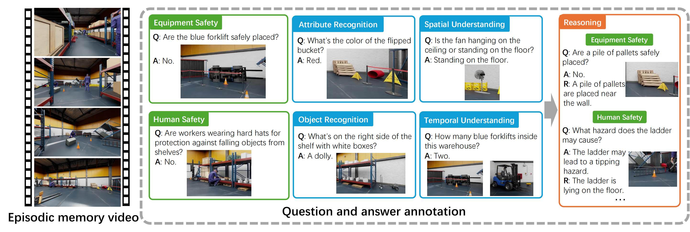

<div align="center">
<h1 align="center">IndustryEQA</h1>

<h3>Pushing the Frontiers of Embodied Question Answering in Industrial Scenarios
</h3>

<p>
Yifan Li<sup>1*</sup>,
Yuhang Chen<sup>2*</sup>,
Anh Dao<sup>1*</sup>,
Lichi Li<sup>3</sup>,
Zhongyi Cai<sup>1</sup>,
Zhen Tan<sup>4</sup>,
Tianlong Chen<sup>2</sup>,
Yu Kong<sup>1</sup>
</p>

<p>
<sup>1</sup>Michigan State University, <sup>2</sup>University of North Carolina at Chapel Hill, <sup>3</sup>Independent Researcher, <sup>4</sup>Arizona State University
</p>
<p>
<sup>*</sup>Equal contribution
</p>

<p>
    <a href="https://johnx69.github.io/IndustryEQA/">
        
    </a>
    <a href="https://arxiv.org/abs/2505.20640">
        
    </a>
    <a href="https://huggingface.co/datasets/IndustryEQA/IndustryEQA">
        
    </a>
    <a href="https://johnx69.github.io/IndustryEQA/#leaderboard">
        
    </a>
</p>

Accepted to **NeurIPS 2025 Datasets and Benchmarks Track**

</div>

### Table of Contents
1. [📖 Abstract](#-abstract)
2. [🏗️ The IndustryEQA Benchmark](#️-the-industryeqa-benchmark)
3. [🚀 Getting Started](#-getting-started)
4. [📊 Dataset](#-dataset)
5. [⚙️ Usage](#️-usage)
6. [📜 Citation](#-citation)
7. [🙏 Acknowledgements](#-acknowledgements)


## 📖 Abstract

Existing Embodied Question Answering (EQA) benchmarks primarily focus on household environments, often overlooking safety-critical aspects and reasoning processes pertinent to industrial settings. This drawback limits the evaluation of agent readiness for real-world industrial applications. To bridge this, we introduce **IndustryEQA**, the first benchmark dedicated to evaluating embodied agent capabilities within safety-critical warehouse scenarios. Built upon the NVIDIA Isaac Sim platform, IndustryEQA provides high-fidelity episodic memory videos featuring diverse industrial assets, dynamic human agents, and carefully designed hazardous situations inspired by real-world safety guidelines. The benchmark includes rich annotations covering six categories: equipment safety, human safety, object recognition, attribute recognition, temporal understanding, and spatial understanding. Besides, it also provides extra reasoning evaluation based on these categories. Specifically, it comprises 971 question-answer pairs generated from small warehouse and 373 pairs from large ones, incorporating scenarios with and without human. We further propose a comprehensive evaluation framework, including various baseline models, to assess their general perception and reasoning abilities in industrial environments. IndustryEQA aims to steer EQA research towards developing more robust, safety-aware, and practically applicable embodied agents for complex industrial environments.


## 🏗️ The IndustryEQA Benchmark

IndustryEQA is the first benchmark designed to evaluate embodied agents in safety-critical industrial warehouse environments. Our goal is to push the boundaries of EQA beyond typical household settings to scenarios that require a deep understanding of safety, spatial reasoning, and human-robot interaction.



The benchmark is built on high-fidelity simulations from **NVIDIA Isaac Sim** and features:

- **1,344 QA Pairs**: A comprehensive set of questions designed to test a range of abilities.
- **76 Episodic Memory Videos**: High-resolution videos capturing diverse and dynamic warehouse scenarios.
- **6 Annotation Categories**: Covering both safety (Equipment and Human Safety) and general perception (Object Recognition, Attribute Recognition, Spatial and Temporal Understanding).
- **A Focus on Safety**: Over 50% of the questions are designed to assess safety awareness, a critical aspect missing from existing EQA benchmarks.
- **Reasoning-Based Evaluation**: In addition to direct answers, we provide detailed reasoning for a subset of questions to enable a deeper evaluation of an agent's understanding.


## 🚀 Getting Started

Follow these steps to set up the environment and begin using the IndustryEQA benchmark.

### 1. Prerequisites

- Python>=3.9

### 2. Installation

First, clone the repository to your local machine:

```
git clone https://github.com/JackYFL/IndustryEQA.git
cd IndustryEQA
```

Next, install the required Python packages using the `requirements.txt` file:

```
conda create -n industryeqa python=3.9
conda activate industryeqa
pip install -r requirements.txt
```

### 3. API Keys

Some of the baseline models require API keys (e.g., for OpenAI's GPT models or Google's Gemini models). Please set these as environment variables in your system. For example:

```
export OPENAI_API_KEY="your_openai_api_key_here"
export GOOGLE_API_KEY="your_google_api_key_here"
```


## 📊 Dataset

You can download the embodied video [here](https://huggingface.co/datasets/IndustryEQA/IndustryEQA). It is recommended to put the video dataset in `/data` folder.

Then you can directly find the json dataset in this repository.

### Structure

The dataset annotations are provided in a single JSON file: `industryeqa.json`. This file contains a list of dictionaries, where each dictionary represents a single question-answer pair and has the following structure:

```
[
    {
        "question_id": 1,
        "type": "Human Safety",
        "question": "What are workers wearing on their heads?",
        "direct_answer": "Baseball caps.",
        "reasoning_answer": "The workers visible are wearing baseball caps on their heads.",
        "path": "data/small/human_1/small_01/video_01.mp4",
        "transformed_status": "1",
        "reasoning_status": "1"
    },
  ...
]
```

- `question_id`: A unique identifier for each QA pair.
- `path`: The corresponding video file for the question.
- `question`: The question in natural language.
- `type`: One of the six annotation categories.
- `direct_answer`: The ground-truth concise answer.
- `reasoning_answer`: A detailed sentence explaining the direct answer, used for the reasoning score evaluation.


## ⚙️ Usage

### Running Baseline Models

You can generate answers for the benchmark questions using the provided baseline model scripts located in `industryeqa/baselines/`.

For example, to run the `gpt-4o` baseline, use the following command:

```
python industryeqa/baselines/gpt-4o.py \
```

Each script in the `baselines` directory is designed to be run similarly.


### Evaluating Results

After generating answers, you can evaluate the performance using our LLM-based evaluation script. The script calculates the **Direct Score** and **Reasoning Score**.

```
python industryeqa/evaluation/direct_match.py \
  --generated-answers /path/to/your/generated_answers.json \
```

This will produce a JSON file containing the scores for each question, which can then be aggregated to get the final performance metrics as reported in our paper.


## 📜 Citation

If you found the IndustryEQA benchmark or code useful in your research, please consider citing our paper:

```
@article{li2025industryeqa,
  title={IndustryEQA: Pushing the Frontiers of Embodied Question Answering in Industrial Scenarios},
  author={Li, Yifan and Chen, Yuhang and Dao, Anh and Li, Lichi and Cai, Zhongyi and Tan, Zhen and Chen, Tianlong and Kong, Yu},
  journal={Advances in Neural Information Processing Systems},
  year={2025}
}
```

## 🙏 Acknowledgements

This project's codebase is adapted from the [OpenEQA](https://github.com/facebookresearch/open-eqa). We sincerely thank the OpenEQA authors for making their code publicly available.